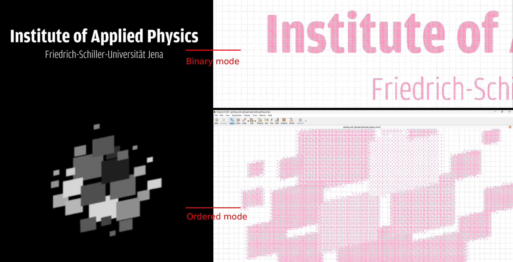

# Image2GDS

This program converts an image into a set of rectangles and generates a GDS file that can be opened in layout editors such as KLayout.

## Installation

Python must be installed on your system.

### 1. Create a virtual environment

**Windows**

```bash
python -m venv env
env\Scripts\activate
```

**Linux / macOS**

```bash
python3 -m venv env
source env/bin/activate
```

### 2. Install dependencies

```bash
pip install -r requirements.txt
```

## Configuration

Edit the parameters in the script before running it:

```python
IMAGE_FILE   = "IAP_logo.png"                # Input image
OUTPUT_FILE  = "IAP_logo_threshold_mode.gds" # Output GDS file

PIXEL_SIZE   = 2   # Micrometers per pixel
BORDER       = 5   # Border offset in micrometers

GDS_LAYER    = 1   # Layer used for image pixels
BORDER_LAYER = 4   # Layer used for the chip border

# Dithering method: 'floyd_steinberg' | 'ordered' | 'threshold'
DITHER_MODE  = "threshold"
```

### Dithering modes

* **threshold**: Best suited for binary images.
* **ordered**: Recommended for grayscale images.
* **floyd_steinberg**: Also produces good results for grayscale images and preserves image details.

## Running the script

```bash
python image2gds.py
```

## Example


